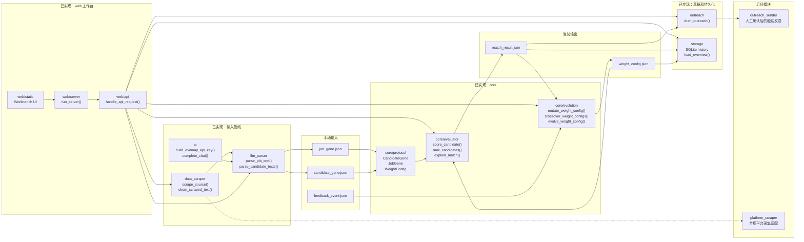

# EvoHunter

EvoHunter 是一个基于 EvoMap GEP 协议的自进化猎头 Agent。目标是实现从候选人搜寻、画像解析、人岗匹配、触达沟通到反馈进化的自动化猎头流程。

## 项目愿景

构建一个能够自主运行、自我迭代的智能猎头系统。系统使用 EvoMap GEP（Gene Expression Programming）协议作为核心数据交换标准，将非结构化候选人信息转成标准基因数据，并通过反馈机制持续进化匹配算法。

## 核心工作流

1. 输入：职位 JD 和目标人才池 URL 或关键词。
2. 感知：Agent 自动爬取多平台候选人公开信息。
3. 解析：将非结构化文本转化为符合 GEP 协议的标准基因序列。
4. 决策：基于 GEP 算法进行人岗匹配度评分与排序。
5. 行动：自动生成个性化沟通话术，并执行触达。
6. 进化：根据回复率、面试通过率等反馈调整 GEP 权重参数。

## 技术栈规划

| 分类 | 技术 |
| --- | --- |
| 语言 | Python 3.10+ |
| AI/LLM | OpenAI API 或 Local LLM |
| 爬虫 | Python 标准库 URL 读取和 HTML 清洗，后续可接 Playwright 或 Scrapy |
| 数据存储 | SQLite |
| 协议层 | EvoMap GEP SDK 自定义模块 |

## 模块拆解

| 模块 | 职责 | 当前状态 |
| --- | --- | --- |
| 模块 A：Core & Protocol | GEP 协议、匹配评分、排序、变异、交叉、反馈进化、规则型置信度和风险标记 | 已实现 |
| 模块 B：Data Scraper | 公开 URL、本地文本、本地 HTML 内容读取、批量清洗和结构化结果 | 已实现 |
| 模块 C：Interaction Agent | 个性化触达草稿生成，不自动发送邮件或 IM | 已实现草稿版本 |
| 模块 D：Dashboard / Workbench | 前端流程工作台、匹配结果展示、步骤状态、概览、历史分析、反馈进化和触达草稿入口 | 已实现 |
| 模块 E：LLM Parser | JD 和候选人文本解析为 GEP JSON，支持 retry、JSON repair、字段补全和解析置信度 | 已实现 |
| 模块 F：Storage | SQLite 持久化评分、反馈、权重、工作台概览和历史分析数据 | 已实现 |

## 当前已实现

当前分支实现 Core、AI 接入、LLM Parser、Data Scraper、SQLite Storage、Interaction Agent 草稿生成和本地 Web Workbench，覆盖工作流中的采集、解析、决策、草稿触达、历史分析和进化部分。

已实现能力：

1. 定义 JD 和候选人的 GEP 基因协议。
2. 根据基因数据计算人岗匹配分。
3. 输出候选人排序和推荐理由。
4. 支持基础变异和交叉算子。
5. 根据反馈事件调整下一轮评分权重。
6. 通过 EvoMap OpenAI-compatible API 解析 JD 和候选人文本。
7. 从公开 URL、本地文本、本地 HTML 读取并清洗候选人或 JD 内容。
8. 批量清洗多个 source，并为每个 source 输出 `source`、`status`、`text`、`error`。
9. 将评分结果、反馈事件和权重配置写入 SQLite。
10. 为候选人生成个性化触达草稿。
11. 提供本地 Web 工作台，串联采集、解析、评分、反馈进化和触达草稿。
12. 工作台会根据解析状态启用评分，根据反馈 JSON 启用进化，并展示维度评分详情和运行概览。
13. 工作台支持 English / 中文界面切换，翻译文案放在 `web/static/locales`。
14. 评分结果输出规则型 `confidence_score` 和 `risk_flags`。
15. 反馈进化可输出 `evolution_summary`，包含事件分布、权重变化和收敛状态。
16. LLM Parser 提供带元数据的解析接口，记录重试次数、修复动作、补全字段和解析置信度。
17. Workbench 提供历史分析，展示评分趋势、候选人历史和 generation 对比。

当前不会登录平台、绕过反爬或采集非公开数据，也不会自动发送邮件、IM 或飞书消息。

## 系统结构



## 已实现目录结构

```text
evohunter/
├── evohunter/
│   ├── __init__.py
│   ├── __main__.py
│   ├── ai/
│   │   ├── __init__.py
│   │   └── client.py
│   ├── core/
│   │   ├── __init__.py
│   │   ├── protocol/
│   │   │   ├── __init__.py
│   │   │   ├── models.py
│   │   │   └── validators.py
│   │   ├── evaluator/
│   │   │   ├── __init__.py
│   │   │   └── evaluator.py
│   │   └── evolution/
│   │       ├── __init__.py
│   │       └── evolution.py
│   ├── data_scraper/
│   │   ├── __init__.py
│   │   └── scraper.py
│   ├── llm_parser/
│   │   ├── __init__.py
│   │   └── parser.py
│   ├── outreach/
│   │   ├── __init__.py
│   │   └── drafts.py
│   ├── storage/
│   │   ├── __init__.py
│   │   └── store.py
│   └── web/
│       ├── __init__.py
│       ├── api.py
│       ├── server.py
│       └── static/
│           ├── app.js
│           ├── index.html
│           ├── locales/
│           │   ├── en.json
│           │   └── zh.json
│           └── styles.css
├── examples/
│   ├── job_gene.json
│   ├── candidate_genes.json
│   ├── feedback_events.json
│   ├── match_results.json
│   └── weight_config.json
├── tests/
├── pyproject.toml
└── README.md
```

Dashboard 原型已收口到 `evohunter/web`，旧的散落原型文件已移除。

## AI、采集和前端模块说明

### `ai`

负责连接 EvoMap OpenAI-compatible API。

外部引用：

1. `openai` Python SDK。
2. EvoMap API 地址：`https://api.evomap.ai/v1`。
3. 鉴权格式：`Authorization: Bearer sk-evomap-<API_KEY>`。

| 接口 | 功能 |
| --- | --- |
| `load_local_env(start_path)` | 从当前目录向上查找 `.env` 并加载本地环境变量 |
| `build_evomap_api_key(api_key)` | 从 `EVOMAP_API_KEY`、`API_KEY` 或入参生成完整 API key |
| `create_evomap_client(api_key, base_url)` | 创建 OpenAI-compatible 客户端 |
| `complete_chat(messages, model, client)` | 调用聊天模型并返回文本内容 |

### `llm_parser`

负责把非结构化文本转成 GEP JSON，并调用 `core/protocol` 校验。

| 接口 | 功能 |
| --- | --- |
| `parse_job_text(text, client, model)` | 把 JD 文本解析成 `job_gene` |
| `parse_job_text_with_metadata(text, client, model, max_attempts)` | 把 JD 文本解析成 `job_gene`，并返回 retry、repair、字段补全和置信度元数据 |
| `parse_candidate_text(text, client, model)` | 把单个候选人文本解析成 `candidate_gene` |
| `parse_candidate_texts(text, client, model)` | 把候选人文本解析成 `candidate_genes` 列表 |
| `parse_candidate_texts_with_metadata(text, client, model, max_attempts)` | 把候选人文本解析成 `candidate_genes`，并返回解析元数据 |

### `data_scraper`

负责读取公开 URL、本地文本、本地 HTML，并清洗成可交给 LLM Parser 的纯文本。批量采集会为每个 source 单独返回成功或失败，不会因为单个失败中断整批。

| 接口 | 功能 |
| --- | --- |
| `scrape_source(source, timeout)` | 从 URL 或本地文件读取并清洗文本 |
| `scrape_sources(sources, timeout)` | 批量读取并返回 `source`、`status`、`text`、`error` |
| `clean_scraped_text(raw_text)` | 去除 HTML 标签、脚本样式和多余空白 |

### `outreach`

负责根据 JD、候选人基因和匹配结果生成触达草稿。

| 接口 | 功能 |
| --- | --- |
| `draft_outreach(job_gene, candidate_gene, match_result, client, model)` | 生成包含 `subject`、`message_body` 和 `rationale` 的触达草稿 |

当前只生成草稿，不自动发送邮件、IM 或飞书消息。

### `storage`

负责把评分、反馈、权重和工作台概览数据写入 SQLite。

| 接口 | 功能 |
| --- | --- |
| `initialize_database(db_path)` | 初始化 SQLite 表结构 |
| `save_job_gene(db_path, job_gene)` | 保存 JD 基因 |
| `save_candidate_genes(db_path, candidate_genes)` | 保存候选人基因 |
| `save_match_results(db_path, match_results)` | 保存匹配结果并记录评分步骤 |
| `save_feedback_events(db_path, feedback_events)` | 保存反馈事件 |
| `save_weight_config(db_path, weight_config, step)` | 保存权重配置，可记录进化步骤 |
| `load_match_result_history(db_path, job_id)` | 读取指定职位的历史匹配结果 |
| `load_overview(db_path)` | 读取工作台概览数据 |
| `load_workbench_history(db_path)` | 读取评分趋势、候选人历史和 generation 对比 |

### `web`

负责提供本地流程式工作台。

| 接口 | 功能 |
| --- | --- |
| `handle_api_request(path, payload)` | 分发工作台 API 请求 |
| `run_server(host, port)` | 启动本地 Web 服务 |
| `web/static/index.html` | 工作台页面结构 |
| `web/static/styles.css` | 工作台视觉样式、语言选择器、步骤完成态、按钮状态、评分详情和历史分析样式 |
| `web/static/app.js` | 工作台交互逻辑、i18n 加载、按钮启用规则、步骤推进、概览、历史分析、草稿和结果渲染 |
| `web/static/locales/en.json` | 英文界面文案 |
| `web/static/locales/zh.json` | 中文界面文案 |

Workbench API 增强：

| API | 功能 |
| --- | --- |
| `/api/parse-job` | 默认返回 `job_gene`；传入 `include_parser_metadata: true` 时返回 `parser_metadata` |
| `/api/parse-candidates` | 默认返回 `candidate_genes`；传入 `include_parser_metadata: true` 时返回 `parser_metadata` |
| `/api/evolve` | 返回 `weight_config` 和 `evolution_summary` |
| `/api/history` | 返回 `score_trend`、`candidate_history` 和 `generation_comparison` |

## Core 模块说明

### `core/protocol`

负责定义 EvoMap GEP 的标准数据结构。

| 接口 | 功能 |
| --- | --- |
| `CandidateGene.from_dict(candidate_gene)` | 从 JSON dict 构造候选人基因 |
| `JobGene.from_dict(job_gene)` | 从 JSON dict 构造职位基因 |
| `WeightConfig.from_dict(weight_config)` | 从 JSON dict 构造并归一化权重配置 |
| `FeedbackEvent.from_dict(feedback_event)` | 从 JSON dict 构造反馈事件 |
| `MatchResult.from_dict(match_result)` | 从 JSON dict 构造匹配结果 |
| `validate_job_gene(job_gene)` | 校验 JD 基因数据是否包含必需字段 |
| `validate_candidate_gene(candidate_gene)` | 校验候选人基因数据是否包含必需字段 |
| `validate_feedback_event(feedback_event)` | 校验反馈事件是否可用于权重更新 |
| `validate_weight_config(weight_config)` | 校验评分权重配置是否完整 |
| `normalize_skill_vector(skill_vector)` | 统一技能名称和技能向量格式 |

### `core/evaluator`

负责进行人岗匹配评分和候选人排序。

| 接口 | 功能 |
| --- | --- |
| `score_candidate(job_gene, candidate_gene, weight_config)` | 计算单个候选人的匹配分数 |
| `rank_candidates(job_gene, candidate_genes, weight_config)` | 对候选人列表排序 |
| `explain_match(job_gene, candidate_gene, score_detail)` | 输出推荐理由 |

### `core/evolution`

负责把反馈事件转成权重调整，并提供基础变异和交叉算子。

| 接口 | 功能 |
| --- | --- |
| `record_feedback(feedback_event)` | 记录候选人的反馈事件 |
| `mutate_weight_config(weight_config, mutation_rate, mutation_strength)` | 对权重配置执行基础变异 |
| `crossover_weight_configs(parent_a, parent_b)` | 对两个权重配置执行交叉 |
| `evolve_weight_config(weight_config, feedback_events)` | 根据反馈事件调整评分权重 |
| `evolve_weight_config_with_summary(weight_config, feedback_events)` | 根据反馈事件调整评分权重，并返回事件分布、权重变化和收敛状态 |

## 使用方式

运行测试：

```bash
python -m pytest
```

配置 EvoMap API key：

```bash
export API_KEY="your_key"
```

也可以使用 `EVOMAP_API_KEY`。代码会自动补齐 `sk-evomap-` 前缀；如果传入的值已经包含该前缀，则保持原值。

程序也会从当前目录向上查找 `.env`。本地开发可以把 `API_KEY` 放在仓库父目录或项目目录的 `.env` 中。

启动本地 Web 工作台：

```bash
python -m evohunter serve --host 127.0.0.1 --port 8000
```

打开：

```text
http://127.0.0.1:8000
```

从本地文件或公开 URL 抓取并清洗文本：

```bash
python -m evohunter scrape \
  --source examples/candidate_profile.html \
  --output /tmp/scraped_text.txt
```

批量抓取并输出结构化 JSON：

```bash
python -m evohunter scrape \
  --source examples/candidate_profile_a.html \
  --source examples/candidate_profile_b.html \
  --output /tmp/scraped_sources.json
```

解析 JD 文本：

```bash
python -m evohunter parse-job \
  --input /tmp/job_description.txt \
  --output /tmp/job_gene.json
```

解析候选人文本：

```bash
python -m evohunter parse-candidates \
  --input /tmp/scraped_text.txt \
  --output /tmp/candidate_genes.json
```

使用带元数据的 Parser：

```python
from evohunter.llm_parser import parse_job_text_with_metadata

output = parse_job_text_with_metadata("AI Agent Engineer, Shanghai, Python")
print(output["job_gene"])
print(output["parser_metadata"]["confidence_score"])
```

计算候选人匹配结果：

```bash
python -m evohunter score \
  --job examples/job_gene.json \
  --candidates examples/candidate_genes.json \
  --weights examples/weight_config.json \
  --output /tmp/match_results.json \
  --db-path .evohunter/workbench.db
```

根据反馈进化权重：

```bash
python -m evohunter evolve \
  --weights examples/weight_config.json \
  --feedback examples/feedback_events.json \
  --output /tmp/weight_config.evolved.json \
  --db-path .evohunter/workbench.db
```

在 Python 中获取进化摘要：

```python
from evohunter.core.evolution import evolve_weight_config_with_summary

output = evolve_weight_config_with_summary({}, [
    {"candidate_id": "c_001", "job_id": "j_001", "event_type": "reply_positive"}
])
print(output["weight_config"])
print(output["evolution_summary"])
```

读取 Workbench 历史分析：

```python
from evohunter.storage import load_workbench_history

history = load_workbench_history(".evohunter/workbench.db")
print(history["score_trend"])
print(history["generation_comparison"])
```

生成触达草稿：

```bash
python -m evohunter draft-outreach \
  --job examples/job_gene.json \
  --candidate /tmp/candidate_gene.json \
  --match /tmp/match_result.json \
  --output /tmp/outreach_draft.json
```

## 数据协议

### `job_gene.json`

```json
{
  "job_id": "j_001",
  "job_title": "ai_agent_engineer",
  "required_skills": ["python", "llm", "playwright"],
  "preferred_skills": ["scrapy", "postgresql"],
  "min_years_of_experience": 3,
  "salary_range": "25k-40k",
  "location": "shanghai",
  "seniority_level": "mid"
}
```

### `candidate_genes.json`

```json
[
  {
    "candidate_id": "c_001",
    "skill_vector": ["python", "llm", "playwright", "scrapy"],
    "years_of_experience": 4,
    "salary_expectation": "30k-35k",
    "location_preference": "shanghai",
    "recent_projects": ["agent_workflow", "crawler_pipeline"],
    "availability": "open",
    "seniority_level": "mid"
  }
]
```

### `weight_config.json`

```json
{
  "generation": 0,
  "skill_weight": 0.4,
  "experience_weight": 0.2,
  "salary_weight": 0.15,
  "location_weight": 0.15,
  "seniority_weight": 0.1
}
```

### `feedback_events.json`

```json
[
  {
    "candidate_id": "c_001",
    "job_id": "j_001",
    "event_type": "reply_positive",
    "event_value": "",
    "event_time": "2026-06-19T17:30:00+08:00"
  }
]
```

支持的 `event_type`：

| 事件 | 说明 |
| --- | --- |
| `reply_positive` | 候选人正向回复 |
| `interview_passed` | 面试通过 |
| `interview_failed` | 面试未通过 |
| `salary_mismatch` | 薪资不匹配 |
| `location_mismatch` | 地点不匹配 |
| `no_reply` | 未回复 |

### `match_results.json`

```json
[
  {
    "candidate_id": "c_001",
    "job_id": "j_001",
    "match_score": 0.92,
    "score_detail": {
      "skill_score": 1.0,
      "experience_score": 1.0,
      "salary_score": 1.0,
      "location_score": 1.0,
      "seniority_score": 1.0
    },
    "recommendation_reason": "技能匹配度高，经验匹配度高，薪资匹配度高，地点匹配度高，职级匹配度高。",
    "confidence_score": 1.0,
    "risk_flags": []
  }
]
```

`confidence_score` 是规则型数据置信度，不代表真实录用概率。`risk_flags` 当前来自技能、经验、薪资、地点和职级五个评分维度。

### `evolution_summary.json`

```json
{
  "generation": 1,
  "total_events": 3,
  "event_counts": {
    "salary_mismatch": 2,
    "location_mismatch": 1
  },
  "weight_changes": {
    "skill_weight": -0.0182,
    "experience_weight": -0.0091,
    "salary_weight": 0.0545,
    "location_weight": 0.0364,
    "seniority_weight": -0.0091
  },
  "change_magnitude": 0.1273,
  "convergence_status": "adjusting"
}
```

### `parser_metadata.json`

```json
{
  "attempt_count": 2,
  "repair_actions": ["retry_after_invalid_json", "extracted_json_object", "defaulted_job_fields"],
  "defaulted_fields": ["job_id"],
  "confidence_score": 0.72
}
```

### `workbench_history.json`

```json
{
  "score_trend": [],
  "candidate_history": {},
  "generation_comparison": []
}
```

### `scraped_sources.json`

```json
[
  {
    "source": "examples/candidate_profile.html",
    "status": "success",
    "text": "Alice Zhang\nPython engineer",
    "error": ""
  },
  {
    "source": "examples/missing.html",
    "status": "error",
    "text": "",
    "error": "source not found: examples/missing.html"
  }
]
```

### `outreach_draft.json`

```json
{
  "candidate_id": "c_001",
  "job_id": "j_001",
  "subject": "AI Agent Engineer opportunity",
  "message_body": "候选人触达草稿正文",
  "rationale": "生成该草稿的匹配依据"
}
```

## 验收标准

1. 可以读取手动准备的 `job_gene.json`、`candidate_genes.json` 和 `weight_config.json`。
2. 可以输出 `match_results.json`。
3. 可以读取 `feedback_events.json`。
4. 可以输出更新后的 `weight_config.json`。
5. 可以从本地文本、本地 HTML 或公开 URL 输出清洗后的文本。
6. 可以通过 EvoMap API 把 JD 文本解析成 `job_gene.json`。
7. 可以通过 EvoMap API 把候选人文本解析成 `candidate_genes.json`。
8. 可以批量清洗多个 source，并对失败 source 返回结构化错误。
9. 可以用 `--db-path` 将评分、反馈和权重写入 SQLite。
10. 可以生成触达草稿，但不会自动发送消息。
11. 可以启动本地 Web 工作台并在浏览器中运行采集、解析、评分、反馈进化和触达草稿。
12. 工作台可以展示候选人数、最高匹配分、当前权重代数和最后步骤。
13. 工作台可以在 English 和中文之间切换，并将选择保存到浏览器本地存储。
14. 所有请求参数和 JSON 字段统一使用 snake_case。
15. 匹配结果可以输出 `confidence_score` 和 `risk_flags`。
16. 反馈进化可以输出 `evolution_summary`。
17. Parser 可以 retry、repair JSON、补全缺失字段，并通过带元数据接口输出 `confidence_score`。
18. 工作台可以展示评分趋势、候选人历史和 generation 对比。
19. `python -m pytest` 全部通过。
