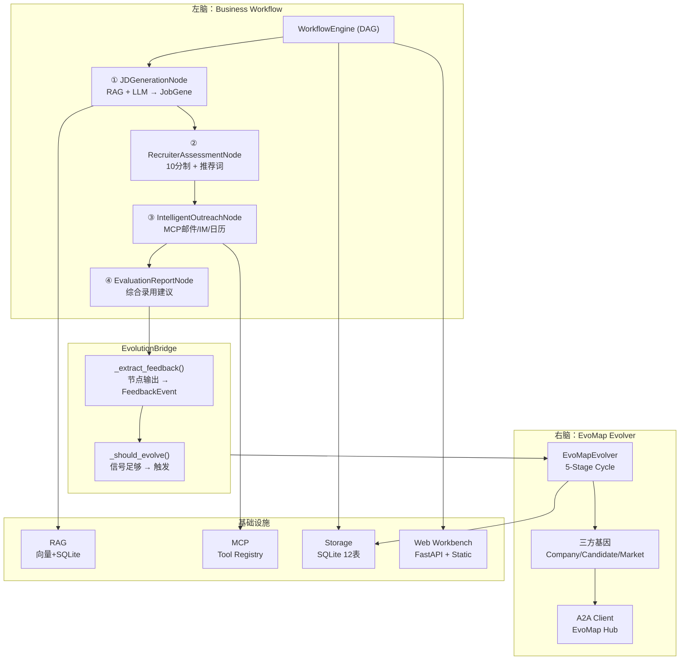

# EvoHunter

EvoHunter 是一个基于 EvoMap GEP 协议的自进化猎头 Agent。采用双脑架构：左脑负责业务流程执行（Workflow），右脑负责能力进化（Evolver）。

## 双脑架构

```
┌─ 左脑 (Business Workflow Layer) ────────────────────────────┐
│                                                              │
│  ① JD生成        ② 猎头评估       ③ 智能触达     ④ 评估报告  │
│  RAG + LLM      10分制评分       MCP邮件/IM    综合录用建议  │
│  → JobGene      ≥7推荐/<7拦截   面试安排       strong_hire/  │
│                                  多轮跟踪       hire/no      │
│                                                              │
├─ EvolutionBridge ────────────────────────────────────────────┤
│  节点输出 → FeedbackEvent → 触发进化                         │
│                                                              │
├─ 右脑 (EvoMap Evolver Engine) ──────────────────────────────┤
│  Scan → Select → Mutate → Validate → Solidify               │
│  三方基因(Company/Candidate/Market) + 双向评分 + A2A交换     │
│                                                              │
├─ 基础设施 ───────────────────────────────────────────────────┤
│  RAG(向量+SQLite) | MCP(Tool Registry) | Web Workbench       │
│  Storage(SQLite) | CLI(12子命令) | API(15端点)               │
└──────────────────────────────────────────────────────────────┘
```

## 核心工作流

1. 输入：职位 JD 和目标人才池 URL 或关键词。
2. 感知：Agent 自动爬取多平台候选人公开信息。
3. 解析：将非结构化文本转化为符合 GEP 协议的标准基因序列。
4. 决策：基于 GEP 算法进行人岗匹配度评分与排序。
5. 行动：自动生成个性化沟通话术，并执行触达。
6. 进化：根据回复率、面试通过率等反馈调整 GEP 权重参数。

## 技术栈规划

| 分类 | 技术 |
| --- | --- |
| 语言 | Python 3.10+ |
| AI/LLM | OpenAI API 或 Local LLM |
| 爬虫 | Python 标准库 URL 读取和 HTML 清洗，后续可接 Playwright 或 Scrapy |
| 数据存储 | SQLite |
| 协议层 | EvoMap GEP SDK 自定义模块 |
| 向量存储 | ChromaDB / FAISS (可选) |
| MCP 协议 | Model Context Protocol (可选) |

## 模块拆解

| 模块 | 职责 | 当前状态 |
| --- | --- | --- |
| 模块 A：Core & Protocol | GEP 协议、匹配评分、排序、变异、交叉、反馈进化、规则型置信度和风险标记 | 已实现 |
| 模块 B：Data Scraper | 公开 URL、本地文本、本地 HTML 内容读取、批量清洗和结构化结果 | 已实现 |
| 模块 C：Interaction Agent | 个性化触达草稿生成，不自动发送邮件或 IM | 已实现草稿版本 |
| 模块 D：Dashboard / Workbench | 前端流程工作台、匹配结果展示、步骤状态、概览、历史分析、反馈进化和触达草稿入口 | 已实现 |
| 模块 E：LLM Parser | JD 和候选人文本解析为 GEP JSON，支持 retry、JSON repair、字段补全和解析置信度 | 已实现 |
| 模块 F：Storage | SQLite 持久化评分、反馈、权重、工作台概览和历史分析数据 | 已实现 |
| **模块 G：Workflow Engine** | **DAG 状态机，4节点猎头管线，左脑业务执行层** | **已实现** |
| **模块 H：RAG 知识库** | **混合检索（向量 + 结构化 SQLite），公司画像、JD 模板、文化标签** | **已实现** |
| **模块 I：MCP 集成层** | **MCP 协议客户端 + Tool Registry，邮件/IM/日历工具适配器** | **已实现** |
| **模块 J：Evolution Bridge** | **左→右脑桥接：节点输出 → FeedbackEvent → EvoMapEvolver** | **已实现** |
| **模块 K：Tech Recruiter Agent** | **10 分制猎头评估，≥7 自动推荐/<7 拦截追问，固定推荐词格式，双语** | **已实现** |

## 当前已实现

当前分支实现完整双脑架构：左脑业务工作流层（Workflow Engine + RAG + MCP + 猎头 Agent）+ 右脑进化引擎（EvoMap Evolver + 三方基因 + 双向评分 + A2A 交换）。

已实现能力：

### 左脑：业务执行层

1. DAG 工作流引擎，支持拓扑排序、循环检测、节点超时、错误传播、依赖跳过。
2. 预构建 3 种工作流：完整管线（4节点）、最小管线（3节点）、仅评估（1节点）。
3. JD 生成节点：RAG 知识库增强 + LLM 生成 → `parse_job_text()` 校验。
4. 猎头评估节点：10 分制评分（70% 硬匹配 + 30% HR 加分），≥7 分自动生成推荐词，<7 分拦截并询问用户，缺失信息（薪资/职级/看机会原因）自动追问。推荐词固定格式：姓名 → 背景概述 → 推荐理由(3-4条) → 技术标签(5-8) → 薪资 → 看机会原因。双语支持（中文/英文）。
5. 智能触达节点：复用 `draft_outreach()` 生成草稿 → MCP 工具发送邮件/IM → 多轮 thread 跟踪 → 面试日历安排。
6. 评估报告节点：综合简历评估 + 面试 Q&A + 背调信息 → 规则型录用建议（strong_hire / hire / weak_hire / no）。
7. EvolutionBridge：自动从节点输出提取 FeedbackEvent → 触发 EvoMapEvolver 进化 → 进化结果写入 storage。

### 右脑：进化引擎层

8. 定义 JD、候选人、公司、市场的 GEP 基因协议和三方基因模型。
9. 双向匹配评分：公司视角 + 候选人视角的双向打分（harmonic mean）。
10. 支持基础变异和交叉算子，5 阶段进化循环（Scan / Select / Mutate / Validate / Solidify）。
11. 根据反馈事件调整评分权重和基因偏好向量。
12. A2A 协议客户端：发布/拉取脱敏基因到 EvoMap Hub。

### 基础设施

13. 混合 RAG 知识库：向量检索（ChromaDB 适配）+ 结构化查询（SQLite），公司画像、JD 模板、文化标签管理。
14. MCP 集成层：通用 MCP 客户端 + Tool Registry，邮件/IM/日历工具适配器，离线优雅降级。
15. 通过 EvoMap OpenAI-compatible API 解析 JD 和候选人文本。
16. 从公开 URL、本地文本、本地 HTML 读取并清洗候选人或 JD 内容。
17. 将评分结果、反馈事件、权重配置、工作流执行、触达 thread、评估报告写入 SQLite（共 12 张表）。
18. 为候选人生成个性化触达草稿。
19. 提供本地 Web 工作台，串联采集、解析、评分、反馈进化、工作流管线、猎头评估、触达草稿和评估报告。
20. 工作台支持 English / 中文界面切换，翻译文案放在 `web/static/locales`。
21. 评分结果输出规则型 `confidence_score` 和 `risk_flags`。
22. 反馈进化可输出 `evolution_summary`，包含事件分布、权重变化和收敛状态。
23. LLM Parser 提供带元数据的解析接口，记录重试次数、修复动作、补全字段和解析置信度。
24. Workbench 提供历史分析，展示评分趋势、候选人历史和 generation 对比。

当前不会登录平台、绕过反爬或采集非公开数据，也不会自动发送邮件、IM 或飞书消息（需配置 MCP Server 后启用）。

## 系统结构



## 已实现目录结构

```text
evohunter/
├── evohunter/
│   ├── __init__.py
│   ├── __main__.py
│   ├── ai/
│   │   ├── __init__.py
│   │   └── client.py
│   ├── core/
│   │   ├── __init__.py
│   │   ├── protocol/
│   │   │   ├── __init__.py
│   │   │   ├── models.py
│   │   │   └── validators.py
│   │   ├── genes/
│   │   │   ├── __init__.py
│   │   │   ├── base.py
│   │   │   ├── company.py
│   │   │   ├── candidate.py
│   │   │   └── market.py
│   │   ├── evaluator/
│   │   │   ├── __init__.py
│   │   │   └── evaluator.py
│   │   ├── evolution/
│   │   │   ├── __init__.py
│   │   │   ├── evolution.py
│   │   │   ├── evolver.py
│   │   │   └── a2a.py
│   │   └── privacy/
│   │       ├── __init__.py
│   │       └── anonymizer.py
│   ├── data_scraper/
│   │   ├── __init__.py
│   │   └── scraper.py
│   ├── llm_parser/
│   │   ├── __init__.py
│   │   └── parser.py
│   ├── outreach/
│   │   ├── __init__.py
│   │   └── drafts.py
│   ├── storage/
│   │   ├── __init__.py
│   │   └── store.py
│   ├── web/
│   │   ├── __init__.py
│   │   ├── api.py
│   │   ├── server.py
│   │   └── static/
│   │       ├── app.js
│   │       ├── index.html
│   │       ├── locales/
│   │       │   ├── en.json
│   │       │   └── zh.json
│   │       └── styles.css
│   ├── workflow/                    # NEW: 左脑工作流引擎
│   │   ├── __init__.py
│   │   ├── models.py
│   │   ├── base.py
│   │   ├── engine.py
│   │   ├── evolution_bridge.py
│   │   ├── prebuilt.py
│   │   └── nodes/
│   │       ├── __init__.py
│   │       ├── jd_generation.py
│   │       ├── resume_parsing.py
│   │       ├── intelligent_outreach.py
│   │       └── evaluation_report.py
│   ├── rag/                         # NEW: 混合 RAG 知识库
│   │   ├── __init__.py
│   │   ├── models.py
│   │   ├── embedding.py
│   │   ├── vector_store.py
│   │   ├── structured_store.py
│   │   └── kb_manager.py
│   └── mcp/                         # NEW: MCP 集成层
│       ├── __init__.py
│       ├── models.py
│       ├── client.py
│       ├── tool_registry.py
│       └── tools/
│           ├── __init__.py
│           ├── email.py
│           ├── im.py
│           └── calendar.py
├── examples/
│   ├── job_gene.json
│   ├── candidate_genes.json
│   ├── feedback_events.json
│   ├── match_results.json
│   └── weight_config.json
├── tests/
│   ├── test_workflow.py             # NEW
│   ├── test_rag.py                  # NEW
│   ├── test_mcp.py                  # NEW
│   ├── test_recruiter.py            # NEW
│   └── ... (existing tests)
├── pyproject.toml
└── README.md
```

## AI、采集和前端模块说明

### `ai`

负责连接 EvoMap OpenAI-compatible API。

外部引用：

1. `openai` Python SDK。
2. EvoMap API 地址：`https://api.evomap.ai/v1`。
3. 鉴权格式：`Authorization: Bearer sk-evomap-<API_KEY>`。

| 接口 | 功能 |
| --- | --- |
| `load_local_env(start_path)` | 从当前目录向上查找 `.env` 并加载本地环境变量 |
| `build_evomap_api_key(api_key)` | 从 `EVOMAP_API_KEY`、`API_KEY` 或入参生成完整 API key |
| `create_evomap_client(api_key, base_url)` | 创建 OpenAI-compatible 客户端 |
| `complete_chat(messages, model, client)` | 调用聊天模型并返回文本内容 |

### `llm_parser`

负责把非结构化文本转成 GEP JSON，并调用 `core/protocol` 校验。

| 接口 | 功能 |
| --- | --- |
| `parse_job_text(text, client, model)` | 把 JD 文本解析成 `job_gene` |
| `parse_job_text_with_metadata(text, client, model, max_attempts)` | 把 JD 文本解析成 `job_gene`，并返回 retry、repair、字段补全和置信度元数据 |
| `parse_candidate_text(text, client, model)` | 把单个候选人文本解析成 `candidate_gene` |
| `parse_candidate_texts(text, client, model)` | 把候选人文本解析成 `candidate_genes` 列表 |
| `parse_candidate_texts_with_metadata(text, client, model, max_attempts)` | 把候选人文本解析成 `candidate_genes`，并返回解析元数据 |

### `data_scraper`

负责读取公开 URL、本地文本、本地 HTML，并清洗成可交给 LLM Parser 的纯文本。批量采集会为每个 source 单独返回成功或失败，不会因为单个失败中断整批。

| 接口 | 功能 |
| --- | --- |
| `scrape_source(source, timeout)` | 从 URL 或本地文件读取并清洗文本 |
| `scrape_sources(sources, timeout)` | 批量读取并返回 `source`、`status`、`text`、`error` |
| `clean_scraped_text(raw_text)` | 去除 HTML 标签、脚本样式和多余空白 |

### `outreach`

负责根据 JD、候选人基因和匹配结果生成触达草稿。

| 接口 | 功能 |
| --- | --- |
| `draft_outreach(job_gene, candidate_gene, match_result, client, model)` | 生成包含 `subject`、`message_body` 和 `rationale` 的触达草稿 |

当前只生成草稿，不自动发送邮件、IM 或飞书消息。

### `storage`

负责把评分、反馈、权重、工作流执行、触达 thread、评估报告写入 SQLite（共 12 张表）。

| 接口 | 功能 |
| --- | --- |
| `initialize_database(db_path)` | 初始化 SQLite 表结构 |
| `save_job_gene(db_path, job_gene)` | 保存 JD 基因 |
| `save_candidate_genes(db_path, candidate_genes)` | 保存候选人基因 |
| `save_match_results(db_path, match_results)` | 保存匹配结果并记录评分步骤 |
| `save_feedback_events(db_path, feedback_events)` | 保存反馈事件 |
| `save_weight_config(db_path, weight_config, step)` | 保存权重配置，可记录进化步骤 |
| `load_match_result_history(db_path, job_id)` | 读取指定职位的历史匹配结果 |
| `load_overview(db_path)` | 读取工作台概览数据 |
| `load_workbench_history(db_path)` | 读取评分趋势、候选人历史和 generation 对比 |
| `save_workflow_execution(db_path, result)` | **保存工作流执行结果** |
| `save_outreach_thread(db_path, thread)` | **保存触达沟通 thread** |
| `load_outreach_thread(db_path, thread_id)` | **读取触达 thread** |
| `save_evaluation_report(db_path, report)` | **保存评估报告** |
| `load_evaluation_reports(db_path, job_id)` | **读取评估报告列表** |

### `web`

负责提供本地流程式工作台。

| 接口 | 功能 |
| --- | --- |
| `handle_api_request(path, payload)` | 分发工作台 API 请求 |
| `run_server(host, port)` | 启动本地 Web 服务 |
| `web/static/index.html` | 工作台页面结构 |
| `web/static/styles.css` | 工作台视觉样式、语言选择器、步骤完成态、按钮状态、评分详情、工作流节点、评估卡片和历史分析样式 |
| `web/static/app.js` | 工作台交互逻辑、i18n 加载、按钮启用规则、步骤推进、概览、历史分析、草稿和结果渲染 |
| `web/static/locales/en.json` | 英文界面文案 |
| `web/static/locales/zh.json` | 中文界面文案 |

Workbench API 全部端点：

| API | 功能 |
| --- | --- |
| `/api/config` | 检查 API key 状态 |
| `/api/overview` | 工作台概览（候选人、最高分、代数、最后步骤） |
| `/api/history` | 历史分析（评分趋势、候选人历史、代际对比） |
| `/api/scrape` | 清洗来源文本 |
| `/api/parse-job` | 解析 JD 文本 → `job_gene`（可选 `include_parser_metadata`） |
| `/api/parse-candidates` | 解析候选人文本 → `candidate_genes`（可选 `include_parser_metadata`） |
| `/api/score` | 人岗匹配评分排序 |
| `/api/evolve` | 反馈进化（可选 `use_evolver_cycle`、`publish_to_hub`、`fetch_from_hub`） |
| `/api/draft-outreach` | 生成触达草稿 |
| **`/api/workflow/execute`** | **执行工作流管线（自动接 EvolutionBridge）** |
| **`/api/workflow/list`** | **列出可用的预构建工作流** |
| **`/api/recruiter/assess`** | **技术猎头评估（10分制 + 推荐词）** |
| **`/api/rag/retrieve`** | **RAG 知识库检索** |
| **`/api/rag/index-company`** | **索引公司画像到 RAG** |
| **`/api/mcp/tools`** | **列出已注册的 MCP 工具** |
| **`/api/mcp/execute`** | **执行 MCP 工具调用** |
| **`/api/evaluation/generate`** | **生成综合评估报告** |

## Core 模块说明

### `core/protocol`

负责定义 EvoMap GEP 的标准数据结构。

| 接口 | 功能 |
| --- | --- |
| `CandidateGene.from_dict(candidate_gene)` | 从 JSON dict 构造候选人基因 |
| `JobGene.from_dict(job_gene)` | 从 JSON dict 构造职位基因 |
| `WeightConfig.from_dict(weight_config)` | 从 JSON dict 构造并归一化权重配置 |
| `FeedbackEvent.from_dict(feedback_event)` | 从 JSON dict 构造反馈事件 |
| `MatchResult.from_dict(match_result)` | 从 JSON dict 构造匹配结果 |
| `validate_job_gene(job_gene)` | 校验 JD 基因数据是否包含必需字段 |
| `validate_candidate_gene(candidate_gene)` | 校验候选人基因数据是否包含必需字段 |
| `validate_feedback_event(feedback_event)` | 校验反馈事件是否可用于权重更新 |
| `validate_weight_config(weight_config)` | 校验评分权重配置是否完整 |
| `normalize_skill_vector(skill_vector)` | 统一技能名称和技能向量格式 |

### `core/genes`

三方基因模型。

| 模型 | 说明 |
| --- | --- |
| `CompanyGene` | 公司基因：偏好权重向量、行业、文化标签、远程策略、历史匹配记录 |
| `CandidateGene` | 候选人基因：技能向量、偏好向量（薪资/远程/成长/稳定/文化）、匹配历史 |
| `MarketGene` | 市场基因：技能别名、技能分类、薪资区间、岗位基线、解析策略、匿名匹配模式 |

所有基因类型支持 `to_dict()` / `from_dict()` / `content_hash()` / `anonymize()`。

### `core/evaluator`

负责进行人岗匹配评分和候选人排序。

| 接口 | 功能 |
| --- | --- |
| `score_candidate(job_gene, candidate_gene, weight_config)` | 计算单个候选人的匹配分数 |
| `rank_candidates(job_gene, candidate_genes, weight_config)` | 对候选人列表排序 |
| `explain_match(job_gene, candidate_gene, score_detail)` | 输出推荐理由 |
| `score_candidate_company_view(job_gene, candidate_gene, weight_config)` | 公司视角单向评分 |
| `score_company_candidate_view(company_gene, candidate_gene)` | 候选人视角单向评分 |
| `score_bidirectional(job_gene, candidate_gene, weight_config, company_gene)` | 双向匹配评分（harmonic mean） |
| `rank_candidates_bidirectional(...)` | 双向评分排序 |

### `core/evolution`

负责把反馈事件转成权重调整，并提供基础变异和交叉算子。

| 接口 | 功能 |
| --- | --- |
| `record_feedback(feedback_event)` | 记录候选人的反馈事件 |
| `mutate_weight_config(weight_config, mutation_rate, mutation_strength)` | 对权重配置执行基础变异 |
| `crossover_weight_configs(parent_a, parent_b)` | 对两个权重配置执行交叉 |
| `evolve_weight_config(weight_config, feedback_events)` | 根据反馈事件调整评分权重 |
| `evolve_weight_config_with_summary(weight_config, feedback_events)` | 根据反馈事件调整评分权重，并返回事件分布、权重变化和收敛状态 |
| `scan_feedback_patterns(feedback_events, match_results)` | 分析反馈事件模式，返回严重程度、影响维度和目标建议 |
| `select_target_dimensions(scan_report, weight_config)` | 根据扫描报告选择目标维度和变异参数 |
| `validate_candidate_weights(candidate, original, ...)` | 用历史数据验证候选权重配置的优劣 |
| `EvoMapEvolver(db_path, evaluator, a2a_client, sender_id)` | 5阶段进化编排器 (Scan, Select, Mutate, Validate, Solidify) |
| `EvoMapEvolver.run_cycle(...)` | 运行完整进化循环，返回进化结果和事件记录 |
| `EvoMapEvolver.run_gene_cycle(...)` | 运行基因偏好进化循环 |
| `A2AClient(sender_id, api_key, base_url)` | A2A 协议客户端，连接 EvoMap Hub |
| `A2AClient.publish_genes(...)` | 发布脱敏三方基因到 Hub |
| `A2AClient.fetch_genes(...)` | 从 Hub 拉取脱敏基因 |
| `EvolutionEvent` | 进化事件模型，记录进化循环元数据 |
| `A2AEnvelope` | A2A 协议消息封套模型 |

## Workflow 模块说明（左脑）

### `workflow`

DAG 工作流引擎，左脑业务执行核心。

| 接口 | 功能 |
| --- | --- |
| `WorkflowDefinition(workflow_id, name, nodes, edges)` | 定义 DAG 工作流，含 `validate()` 和 `topological_sort()` |
| `WorkflowEngine(definition)` | DAG 编排器，按拓扑顺序同步执行节点 |
| `WorkflowEngine.register_node(node)` | 注册节点实现 |
| `WorkflowEngine.execute(context)` | 执行工作流，返回 `WorkflowResult` |
| `WorkflowContext(workflow_id, input_data)` | 工作流上下文，节点间数据传递 |
| `BaseWorkflowNode` | 节点抽象基类：`execute()` / `validate_input()` / `on_error()` |
| `EvolutionBridge(db_path, sender_id)` | **左→右脑桥接**：节点输出 → FeedbackEvent → EvoMapEvolver |
| `EvolutionBridge.after_workflow(result, weight_config)` | 工作流执行后自动触发进化 |
| `run_workflow_with_evolution(engine, context, ...)` | 一键执行工作流 + 进化 |

### `workflow/nodes`

| 节点 | 功能 |
| --- | --- |
| `JDGenerationNode(ai_client, kb_manager)` | ① JD 生成：RAG 检索 → LLM 生成 → `parse_job_text()` 校验 |
| `RecruiterAssessmentNode(ai_client, model)` | ② 猎头评估：10 分制评分 + 推荐词生成 + 信息完整性检查 |
| `IntelligentOutreachNode(mcp_registry, ai_client)` | ③ 智能触达：草稿生成 → MCP 发送 → thread 跟踪 → 面试安排 |
| `EvaluationReportNode(ai_client, model)` | ④ 评估报告：综合简历/面试/背调 → 录用建议 |

### `workflow/prebuilt`

| 工厂函数 | 说明 |
| --- | --- |
| `create_full_headhunting_workflow(...)` | 完整 4 节点管线 |
| `create_minimal_workflow(...)` | 最小 3 节点管线（无触达） |
| `create_assessment_only_workflow(...)` | 仅评估模式（1 节点） |

## RAG 模块说明

混合知识库：向量语义搜索 + 结构化 SQLite 查询。

| 接口 | 功能 |
| --- | --- |
| `EmbeddingProvider(model, dimension, client)` | 文本 → 嵌入向量（API 或本地 fallback） |
| `VectorStore(dimension, backend, persist_path)` | 向量存储：add / search / delete / persist / load |
| `StructuredKnowledgeStore(db_path)` | SQLite 存储：公司画像、JD 模板、文化标签 |
| `KnowledgeBaseManager(vector_store, structured_store, embedder)` | 混合检索编排：`retrieve_for_jd_generation()` / `retrieve_for_resume_parsing()` / `index_company()` / `index_jd_template()` |

## MCP 模块说明

Model Context Protocol 集成层，连接外部工具。

| 接口 | 功能 |
| --- | --- |
| `MCPClient(config)` | 通用 MCP 协议客户端：`discover_tools()` / `call_tool()` / `health_check()` |
| `MCPToolRegistry()` | 工具注册中心：`register_tool()` / `discover_from_client()` / `execute_tool()` / `execute_tool_by_name()` |
| `register_email_tools(registry, client)` | 注册邮件工具（send / receive） |
| `register_im_tools(registry, client)` | 注册 IM 工具（send / receive） |
| `register_calendar_tools(registry, client)` | 注册日历工具（create_event / check_availability / list_events） |

## 共享基因池架构

多台机器或同一台机器上启动多个 EvoHunter 实例时，可以通过 EvoMap Hub 的 A2A 协议共享进化出的最优权重和脱敏基因，实现并发进化。

```
可交换（脱敏后）                  脱敏方式                      价值
──────────────────────────────────────────────────────────────────────
候选人基因                       去姓名、联系方式、公司名         多个Agent不用重复解析同一简历
                                保留 skill_vector + 经验年限      交叉验证：同一候选人被多公司面试的结果
                                用 candidate_hash 标识

公司基因                         去公司名、具体JD内容             新Agent快速了解这家公司的偏好
                                保留行业标签 + 偏好权重          同公司不同岗位共享经验

匹配结果（匿名化）               只留特征向量和结果                 "技能0.9+经验4年的候选人面试通过率85%"
                                "skill:0.9, exp:4年 → passed"   "这家公司对薪资弹性大"
                                不暴露谁被谁录用                 作为进化的训练样本
```

### A2A 工作模式

| 模式 | 网络 | 说明 |
| --- | --- | --- |
| 本地循环 | 无 | 5阶段进化完全在本地运行 |
| 发布 | 可选 | 脱敏基因通过 A2A 发送到 Hub |
| 拉取 | 可选 | 从 Hub 获取优质基因混合到本地变异池 |
| 完整循环 | 两者 | Fetch → 本地进化 → Publish |

## 使用方式

运行测试：

```bash
python -m pytest
```

配置 EvoMap API key：

```bash
export API_KEY="your_key"
```

也可以使用 `EVOMAP_API_KEY`。代码会自动补齐 `sk-evomap-` 前缀；如果传入的值已经包含该前缀，则保持原值。

程序也会从当前目录向上查找 `.env`。本地开发可以把 `API_KEY` 放在仓库父目录或项目目录的 `.env` 中。

启动本地 Web 工作台：

```bash
python -m evohunter serve --host 127.0.0.1 --port 8000
```

打开：

```text
http://127.0.0.1:8000
```

从本地文件或公开 URL 抓取并清洗文本：

```bash
python -m evohunter scrape \
  --source examples/candidate_profile.html \
  --output /tmp/scraped_text.txt
```

批量抓取并输出结构化 JSON：

```bash
python -m evohunter scrape \
  --source examples/candidate_profile_a.html \
  --source examples/candidate_profile_b.html \
  --output /tmp/scraped_sources.json
```

解析 JD 文本：

```bash
python -m evohunter parse-job \
  --input /tmp/job_description.txt \
  --output /tmp/job_gene.json
```

解析候选人文本：

```bash
python -m evohunter parse-candidates \
  --input /tmp/scraped_text.txt \
  --output /tmp/candidate_genes.json
```

使用带元数据的 Parser：

```python
from evohunter.llm_parser import parse_job_text_with_metadata

output = parse_job_text_with_metadata("AI Agent Engineer, Shanghai, Python")
print(output["job_gene"])
print(output["parser_metadata"]["confidence_score"])
```

计算候选人匹配结果：

```bash
python -m evohunter score \
  --job examples/job_gene.json \
  --candidates examples/candidate_genes.json \
  --weights examples/weight_config.json \
  --output /tmp/match_results.json \
  --db-path .evohunter/workbench.db
```

根据反馈进化权重：

```bash
python -m evohunter evolve \
  --weights examples/weight_config.json \
  --feedback examples/feedback_events.json \
  --output /tmp/weight_config.evolved.json \
  --db-path .evohunter/workbench.db
```

在 Python 中获取进化摘要：

```python
from evohunter.core.evolution import evolve_weight_config_with_summary

output = evolve_weight_config_with_summary({}, [
    {"candidate_id": "c_001", "job_id": "j_001", "event_type": "reply_positive"}
])
print(output["weight_config"])
print(output["evolution_summary"])
```

生成触达草稿：

```bash
python -m evohunter draft-outreach \
  --job examples/job_gene.json \
  --candidate /tmp/candidate_gene.json \
  --match /tmp/match_result.json \
  --output /tmp/outreach_draft.json
```

### 左脑工作流命令

执行完整猎头管线：

```bash
python -m evohunter workflow \
  --id full_headhunting \
  --inputs '{"company_name":"某AI公司","role_title":"AI Agent Engineer","resume_text":"候选人简历文本...","language":"zh"}' \
  --output /tmp/workflow_result.json \
  --db-path .evohunter/workbench.db
```

技术猎头评估：

```bash
python -m evohunter recruiter-assess \
  --job-gene examples/job_gene.json \
  --resume /tmp/resume.txt \
  --language zh \
  --output /tmp/assessment.json
```

RAG 知识库索引：

```bash
python -m evohunter rag-index \
  --company-name "某AI公司" \
  --industry tech \
  --description "专注于大语言模型应用的AI创业公司" \
  --db-path .evohunter/rag.db \
  --output /tmp/company_profile.json
```

生成评估报告：

```bash
python -m evohunter evaluate \
  --assessment /tmp/assessment.json \
  --interview-qa '[{"question":"...","answer":"...","score":8}]' \
  --background-check '{"red_flags":[]}' \
  --output /tmp/evaluation_report.json
```

启动 Web 服务：

```bash
python -m evohunter serve --host 127.0.0.1 --port 8000
```

## 数据协议

### `job_gene.json`

```json
{
  "job_id": "j_001",
  "job_title": "ai_agent_engineer",
  "required_skills": ["python", "llm", "playwright"],
  "preferred_skills": ["scrapy", "postgresql"],
  "min_years_of_experience": 3,
  "salary_range": "25k-40k",
  "location": "shanghai",
  "seniority_level": "mid"
}
```

### `candidate_genes.json`

```json
[
  {
    "candidate_id": "c_001",
    "skill_vector": ["python", "llm", "playwright", "scrapy"],
    "years_of_experience": 4,
    "salary_expectation": "30k-35k",
    "location_preference": "shanghai",
    "recent_projects": ["agent_workflow", "crawler_pipeline"],
    "availability": "open",
    "seniority_level": "mid"
  }
]
```

### `weight_config.json`

```json
{
  "generation": 0,
  "skill_weight": 0.4,
  "experience_weight": 0.2,
  "salary_weight": 0.15,
  "location_weight": 0.15,
  "seniority_weight": 0.1
}
```

### `feedback_events.json`

```json
[
  {
    "candidate_id": "c_001",
    "job_id": "j_001",
    "event_type": "reply_positive",
    "event_value": "",
    "event_time": "2026-06-19T17:30:00+08:00"
  }
]
```

支持的 `event_type`：

| 事件 | 说明 |
| --- | --- |
| `reply_positive` | 候选人正向回复 |
| `interview_passed` | 面试通过 |
| `interview_failed` | 面试未通过 |
| `salary_mismatch` | 薪资不匹配 |
| `location_mismatch` | 地点不匹配 |
| `no_reply` | 未回复 |

### `match_results.json`

```json
[
  {
    "candidate_id": "c_001",
    "job_id": "j_001",
    "match_score": 0.92,
    "score_detail": {
      "skill_score": 1.0,
      "experience_score": 1.0,
      "salary_score": 1.0,
      "location_score": 1.0,
      "seniority_score": 1.0
    },
    "recommendation_reason": "技能匹配度高，经验匹配度高，薪资匹配度高，地点匹配度高，职级匹配度高。",
    "confidence_score": 1.0,
    "risk_flags": []
  }
]
```

`confidence_score` 是规则型数据置信度，不代表真实录用概率。`risk_flags` 当前来自技能、经验、薪资、地点和职级五个评分维度。

### `evolution_summary.json`

```json
{
  "generation": 1,
  "total_events": 3,
  "event_counts": {
    "salary_mismatch": 2,
    "location_mismatch": 1
  },
  "weight_changes": {
    "skill_weight": -0.0182,
    "experience_weight": -0.0091,
    "salary_weight": 0.0545,
    "location_weight": 0.0364,
    "seniority_weight": -0.0091
  },
  "change_magnitude": 0.1273,
  "convergence_status": "adjusting"
}
```

### `parser_metadata.json`

```json
{
  "attempt_count": 2,
  "repair_actions": ["retry_after_invalid_json", "extracted_json_object", "defaulted_job_fields"],
  "defaulted_fields": ["job_id"],
  "confidence_score": 0.72
}
```

### `workbench_history.json`

```json
{
  "score_trend": [],
  "candidate_history": {},
  "generation_comparison": []
}
```

### `scraped_sources.json`

```json
[
  {
    "source": "examples/candidate_profile.html",
    "status": "success",
    "text": "Alice Zhang\nPython engineer",
    "error": ""
  },
  {
    "source": "examples/missing.html",
    "status": "error",
    "text": "",
    "error": "source not found: examples/missing.html"
  }
]
```

### `outreach_draft.json`

```json
{
  "candidate_id": "c_001",
  "job_id": "j_001",
  "subject": "AI Agent Engineer opportunity",
  "message_body": "候选人触达草稿正文",
  "rationale": "生成该草稿的匹配依据"
}
```

### 新增：猎头评估 `recruiter_assessment.json`

```json
{
  "candidate_name": "Alice Zhang",
  "match_degree": 8,
  "hard_match_score": 6.5,
  "hr_bonus_score": 1.5,
  "main_match_points": ["技能完全覆盖JD要求", "5年相关经验且为高级工程师"],
  "main_deductions": ["简历中未体现学历背景"],
  "conclusion": "强匹配",
  "background_summary": "5年Python后端及LLM应用开发经验...",
  "reasons_for_recommendation": ["具备LLM应用架构设计经验...", "掌握岗位所需核心技术栈..."],
  "tech_tags": ["Python", "LLM", "LangChain", "Docker", "RAG"],
  "current_salary": "35k/月",
  "current_level": "高级工程师",
  "reason_for_leaving": "希望做更有技术深度的产品",
  "recommendation_text": "Alice Zhang\n\n5年Python后端...\n\n推荐理由\n1. ...",
  "requires_human_input": false,
  "missing_fields": []
}
```

### 新增：评估报告 `evaluation_report.json`

```json
{
  "report_id": "rpt_a1b2c3d4e5f6",
  "candidate_hash": "Alice Zhang",
  "job_id": "j_001",
  "final_recommendation": "strong_hire",
  "resume_summary": "...",
  "match_assessment": {},
  "interview_qa": [],
  "background_check": {},
  "overall_risk": "low",
  "created_at": "2026-06-21T..."
}
```

## 验收标准

1. 可以读取手动准备的 `job_gene.json`、`candidate_genes.json` 和 `weight_config.json`。
2. 可以输出 `match_results.json`。
3. 可以读取 `feedback_events.json`。
4. 可以输出更新后的 `weight_config.json`。
5. 可以从本地文本、本地 HTML 或公开 URL 输出清洗后的文本。
6. 可以通过 EvoMap API 把 JD 文本解析成 `job_gene.json`。
7. 可以通过 EvoMap API 把候选人文本解析成 `candidate_genes.json`。
8. 可以批量清洗多个 source，并对失败 source 返回结构化错误。
9. 可以用 `--db-path` 将评分、反馈和权重写入 SQLite。
10. 可以生成触达草稿，但不会自动发送消息。
11. 可以启动本地 Web 工作台并在浏览器中运行采集、解析、评分、反馈进化和触达草稿。
12. 工作台可以展示候选人数、最高匹配分、当前权重代数和最后步骤。
13. 工作台可以在 English 和中文之间切换，并将选择保存到浏览器本地存储。
14. 所有请求参数和 JSON 字段统一使用 snake_case。
15. 匹配结果可以输出 `confidence_score` 和 `risk_flags`。
16. 反馈进化可以输出 `evolution_summary`。
17. Parser 可以 retry、repair JSON、补全缺失字段，并通过带元数据接口输出 `confidence_score`。
18. 工作台可以展示评分趋势、候选人历史和 generation 对比。
19. DAG 工作流引擎：拓扑排序、循环检测、节点超时、错误传播、依赖跳过。
20. 猎头 Agent 10 分制评估：≥7 自动生成推荐词，<7 拦截追问，缺失信息自动检测。
21. RAG 混合检索：向量语义搜索 + 结构化 SQLite 查询。
22. MCP 工具注册与调用：离线优雅降级。
23. EvolutionBridge：工作流完成后自动触发右脑进化。
24. `python -m pytest` 全部通过。
