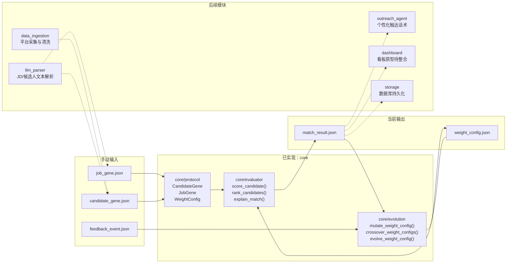

# EvoHunter

EvoHunter 是一个基于 EvoMap GEP 协议的自进化猎头 Agent。目标是实现从候选人搜寻、画像解析、人岗匹配、触达沟通到反馈进化的自动化猎头流程。

## 项目愿景

构建一个能够自主运行、自我迭代的智能猎头系统。系统使用 EvoMap GEP（Gene Expression Programming）协议作为核心数据交换标准，将非结构化候选人信息转成标准基因数据，并通过反馈机制持续进化匹配算法。

## 核心工作流

1. 输入：职位 JD 和目标人才池 URL 或关键词。
2. 感知：Agent 自动爬取多平台候选人公开信息。
3. 解析：将非结构化文本转化为符合 GEP 协议的标准基因序列。
4. 决策：基于 GEP 算法进行人岗匹配度评分与排序。
5. 行动：自动生成个性化沟通话术，并执行触达。
6. 进化：根据回复率、面试通过率等反馈调整 GEP 权重参数。

## 技术栈规划

| 分类 | 技术 |
| --- | --- |
| 语言 | Python 3.10+ |
| AI/LLM | OpenAI API 或 Local LLM |
| 爬虫 | Playwright 或 Scrapy |
| 数据存储 | SQLite 或 PostgreSQL |
| 协议层 | EvoMap GEP SDK 自定义模块 |

## 模块拆解

| 模块 | 职责 | 当前状态 |
| --- | --- | --- |
| 模块 A：Core & Protocol | GEP 协议、匹配评分、排序、变异、交叉、反馈进化 | 已实现 |
| 模块 B：Data Scraper | 多平台候选人采集、清洗、标准 JSON 输出 | 暂未实现 |
| 模块 C：Interaction Agent | 个性化话术生成、邮件或 IM 触达、回复状态回传 | 暂未实现 |
| 模块 D：Dashboard | 进化代数、匹配成功率趋势、候选人处理列表 | 已有原型，未整合进包 |

## 当前已实现：Core

当前分支完整实现模块 A，覆盖工作流中的决策和进化部分。

已实现能力：

1. 定义 JD 和候选人的 GEP 基因协议。
2. 根据基因数据计算人岗匹配分。
3. 输出候选人排序和推荐理由。
4. 支持基础变异和交叉算子。
5. 根据反馈事件调整下一轮评分权重。

当前输入使用手动准备的 JSON，不接真实爬虫，不自动触达候选人。

## 系统结构



## 已实现目录结构

```text
evohunter/
├── evohunter/
│   ├── __init__.py
│   ├── __main__.py
│   └── core/
│       ├── __init__.py
│       ├── protocol/
│       │   ├── __init__.py
│       │   ├── models.py
│       │   └── validators.py
│       ├── evaluator/
│       │   ├── __init__.py
│       │   └── evaluator.py
│       └── evolution/
│           ├── __init__.py
│           └── evolution.py
├── examples/
│   ├── job_gene.json
│   ├── candidate_genes.json
│   ├── feedback_events.json
│   ├── match_results.json
│   └── weight_config.json
├── tests/
├── pyproject.toml
└── README.md
```

Dashboard 原型来自 `main` 分支，当前文件为 `Untitled-1.html`、`Untitled-1.py` 和 `src/import random.py`。这些文件尚未整合到 Python 包结构中。

## Core 模块说明

### `core/protocol`

负责定义 EvoMap GEP 的标准数据结构。

| 接口 | 功能 |
| --- | --- |
| `CandidateGene.from_dict(candidate_gene)` | 从 JSON dict 构造候选人基因 |
| `JobGene.from_dict(job_gene)` | 从 JSON dict 构造职位基因 |
| `WeightConfig.from_dict(weight_config)` | 从 JSON dict 构造并归一化权重配置 |
| `FeedbackEvent.from_dict(feedback_event)` | 从 JSON dict 构造反馈事件 |
| `MatchResult.from_dict(match_result)` | 从 JSON dict 构造匹配结果 |
| `validate_job_gene(job_gene)` | 校验 JD 基因数据是否包含必需字段 |
| `validate_candidate_gene(candidate_gene)` | 校验候选人基因数据是否包含必需字段 |
| `validate_feedback_event(feedback_event)` | 校验反馈事件是否可用于权重更新 |
| `validate_weight_config(weight_config)` | 校验评分权重配置是否完整 |
| `normalize_skill_vector(skill_vector)` | 统一技能名称和技能向量格式 |

### `core/evaluator`

负责进行人岗匹配评分和候选人排序。

| 接口 | 功能 |
| --- | --- |
| `score_candidate(job_gene, candidate_gene, weight_config)` | 计算单个候选人的匹配分数 |
| `rank_candidates(job_gene, candidate_genes, weight_config)` | 对候选人列表排序 |
| `explain_match(job_gene, candidate_gene, score_detail)` | 输出推荐理由 |

### `core/evolution`

负责把反馈事件转成权重调整，并提供基础变异和交叉算子。

| 接口 | 功能 |
| --- | --- |
| `record_feedback(feedback_event)` | 记录候选人的反馈事件 |
| `mutate_weight_config(weight_config, mutation_rate, mutation_strength)` | 对权重配置执行基础变异 |
| `crossover_weight_configs(parent_a, parent_b)` | 对两个权重配置执行交叉 |
| `evolve_weight_config(weight_config, feedback_events)` | 根据反馈事件调整评分权重 |

## 使用方式

运行测试：

```bash
python -m pytest
```

计算候选人匹配结果：

```bash
python -m evohunter score \
  --job examples/job_gene.json \
  --candidates examples/candidate_genes.json \
  --weights examples/weight_config.json \
  --output /tmp/match_results.json
```

根据反馈进化权重：

```bash
python -m evohunter evolve \
  --weights examples/weight_config.json \
  --feedback examples/feedback_events.json \
  --output /tmp/weight_config.evolved.json
```

## 数据协议

### `job_gene.json`

```json
{
  "job_id": "j_001",
  "job_title": "ai_agent_engineer",
  "required_skills": ["python", "llm", "playwright"],
  "preferred_skills": ["scrapy", "postgresql"],
  "min_years_of_experience": 3,
  "salary_range": "25k-40k",
  "location": "shanghai",
  "seniority_level": "mid"
}
```

### `candidate_genes.json`

```json
[
  {
    "candidate_id": "c_001",
    "skill_vector": ["python", "llm", "playwright", "scrapy"],
    "years_of_experience": 4,
    "salary_expectation": "30k-35k",
    "location_preference": "shanghai",
    "recent_projects": ["agent_workflow", "crawler_pipeline"],
    "availability": "open",
    "seniority_level": "mid"
  }
]
```

### `weight_config.json`

```json
{
  "generation": 0,
  "skill_weight": 0.4,
  "experience_weight": 0.2,
  "salary_weight": 0.15,
  "location_weight": 0.15,
  "seniority_weight": 0.1
}
```

### `feedback_events.json`

```json
[
  {
    "candidate_id": "c_001",
    "job_id": "j_001",
    "event_type": "reply_positive",
    "event_value": "",
    "event_time": "2026-06-19T17:30:00+08:00"
  }
]
```

支持的 `event_type`：

| 事件 | 说明 |
| --- | --- |
| `reply_positive` | 候选人正向回复 |
| `interview_passed` | 面试通过 |
| `interview_failed` | 面试未通过 |
| `salary_mismatch` | 薪资不匹配 |
| `location_mismatch` | 地点不匹配 |
| `no_reply` | 未回复 |

## 验收标准

1. 可以读取手动准备的 `job_gene.json`、`candidate_genes.json` 和 `weight_config.json`。
2. 可以输出 `match_results.json`。
3. 可以读取 `feedback_events.json`。
4. 可以输出更新后的 `weight_config.json`。
5. 所有请求参数和 JSON 字段统一使用 snake_case。
6. `python -m pytest` 全部通过。
